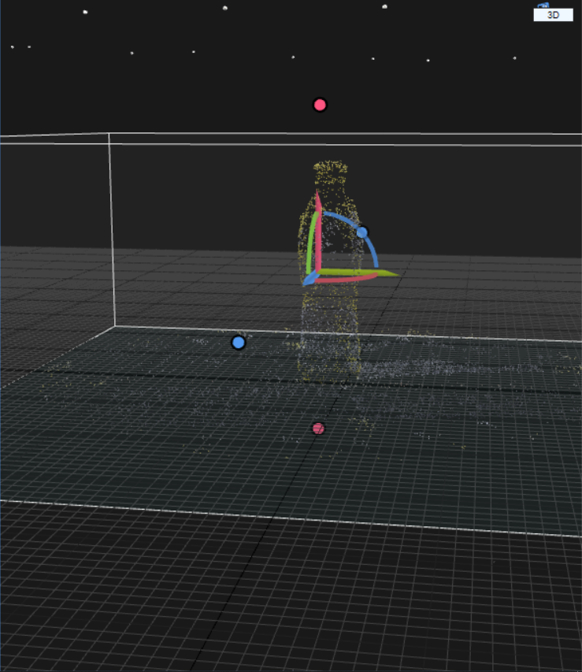
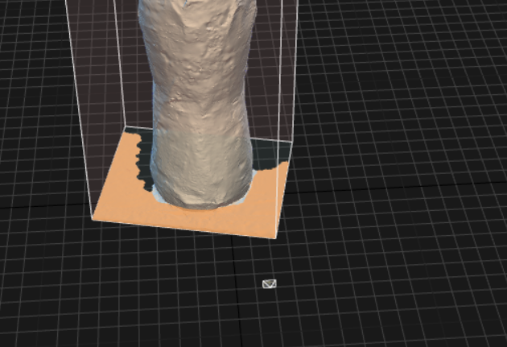

## 使用RealityCapture构建CAD Model

* STEP1 导入图片并对齐
* STEP2 利用对齐的稀疏点云重建

### STEP1 导入图片并对齐

#### 导入图片

对图片的说明：每个物体分别有以(15°)、30°、45°、(60°)俯视角拍摄的若干组照片，每组照片24张。把所有的照片导入会导致重建比较慢，因而对一般物体来说：

* 若能够从45°看清物体全貌的，只导入45°的24张照片
* 若45°看不清，如下图：（瓶底弧形有信息缺失）

  

  则选取30°的24张图片进行导入

* 对于存在内侧面的物体（马克杯、碗、水桶），必须选择能够看清内侧底面的俯视角，如有必要则需选择两个不同的俯视角共48张图片

推荐俯视角：

* 玩具车：30°
* 马克杯：45°
* 瓶子：30°
* 碗：45°
* 锤子：30°
* 笔记本电脑：30°
* 保险箱：45°
* 水桶：60°
* 钳子：30°
* 柜子：待定

#### 对齐图片

官网教程：https://support.capturingreality.com/hc/en-us/articles/360013467579-How-to-create-your-first-3D-model-RealityCapture-tutorial-Series Part 2

在导入图片后，点击**ALIGNMENT->Align Images**，即可开始对齐

对齐结束后，会出现稀疏点云，如图所示：

​	可以看出稀疏点云已经有了物体的形状，并还原的较好，这样的点云是合格的

​	但是可能出现以下错误的情况：

+ 对齐结束后没有点云出现，这种情况是图片不合要求导致的。这种情况下可以重新对齐图片或换个角度的图片导入对齐。

+ 点云结果有明显的重影，这种情况是导入多个俯视角的图片，但是这些图片的相机位置还原并不理想导致的。这种情况下可以只导入单个俯视角的图片进行对齐尝试。

### STEP2 利用对齐的稀疏点云重建

#### 将物体和地面平行

点击**RECONSTRUCTION->Define Ground Plane**，如下图

鼠标左键调整，让桌面这层薄薄的点云和虚拟环境中的地面平行即可

#### 调整bounding box

得到稀疏点云之后，可以看出有很多环境点云和噪声存在，我们需要调整bounding box的范围

将bounding box只包含物体和物体下方的少量地面即可

效果如下图

注：可以通过**RECONSTRUCTION->Set Reconstruction Region**来重新获得bounding box

注：Bounding box的底面需要尽量贴合物体和桌面点云的切面，尽量少的包含桌面的点，方便后续操作

#### 重建

官网教程：https://support.capturingreality.com/hc/en-us/articles/360013467579-How-to-create-your-first-3D-model-RealityCapture-tutorial-Series Part 3

点击**RECONSTRUCTION->Normal Detail**进行重建，如下图

等待一段时间后得到初步结果

此处可以看到底部的桌面还是有部分残留，需要清除

#### 清除和后续

清除操作如下：

1. 在RECONSTRUCTION-Selection操作栏中，选取**Lasso**，将需要切除的地方围起来

   

2. 在RECONSTRUCTION-Tools操作栏中点击**Filter Selection**，即可清除

   

   但此时仍有部分结构不合理的地方（图中紫色的部分）

3. 在RECONSTRUCTION-Tools操作栏中点击**Clean Model**，即可使结构合理

   

4. 重复上述操作直至没有噪点

5. （推荐）在RECONSTRUCTION-Selection操作栏中点击**Advanced**->左下Advanced Selection Tool栏中**Select the largest connected component**->在RECONSTRUCTION-Selection操作栏中点击**Invert**->在RECONSTRUCTION-Tools操作栏中点击**Filter Selection**，即可删除物体所在连通块以外的部分

6. 点击**Check Integrity**和**Check Topology**检查模型是否合理，显示ok即可（否则需要点击**Clean Model**）

在得到干净的模型之后，可点击**Texture**给模型添加纹理

#### 保存和导出

保存：

点击后save as到你想保存的位置，即可保存整个project

导出点击**RECONSTRUCTION->Mesh**即可生成.obj文件，保存在想要保存的位置即可

### 附录

官网教程：https://support.capturingreality.com/hc/en-us/articles/360013467579-How-to-create-your-first-3D-model-RealityCapture-tutorial-Series